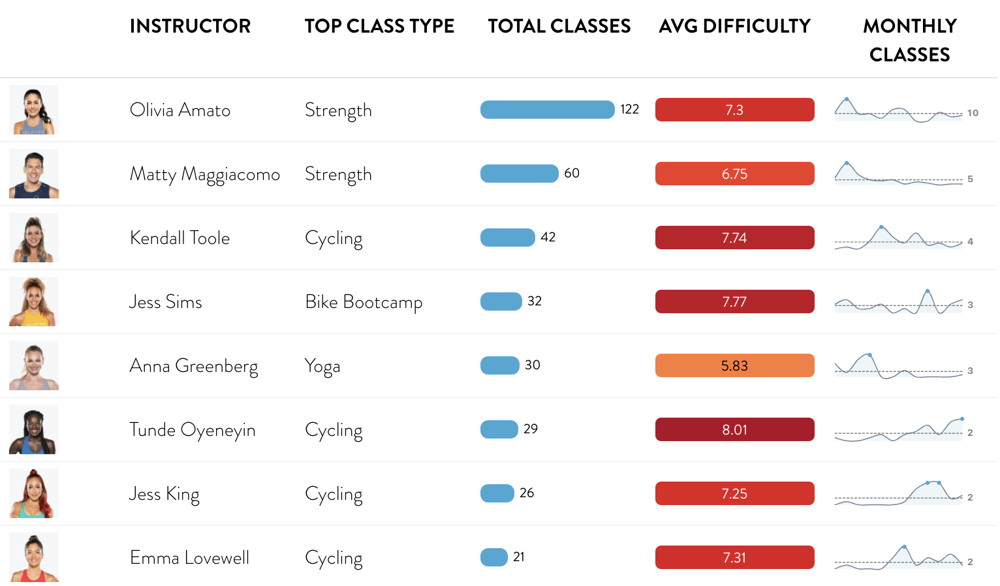

# Peloton Summary

This project provides an overview on how to collect personal Peloton data to create and summarize one's own workout information.

## Peloton Background

Peloton is a tech/fitness company whose goal is to "bring ...the excitement of boutique fitness into the home." Peloton was founded in 2012, and produces fitess equipment such as the Peloton Bike and Peloton Tread. The company also rolled out an interactive app that allows users to take classes from anywhere (membership based fee). Although Peloton is known originally for their bike equipment and classes, the company has branched out into other modals of fitness.

Excerpt from [Wikipedia](https://en.wikipedia.org/wiki/Peloton_(exercise_equipment_company)):

> While Peloton's flagship offerings are cycling and running classes using their exercise machines, they also offer classes in strength training, yoga, cardio aerobic exercise, meditation, stretching, tread bootcamp, bike bootcamp, and walking.[ Classes are recorded daily and streamed live from instructors' homes or Peloton's cycling studios in Hudson Yards, Manhattan and London and are then uploaded to the Peloton library for on-demand access 24/7. Peloton produces up to 19 new classes a day.

## Data

Data was collected using the Peloton API with an R wrapper, pelotonR. The R library pelotonR was created by Laura Ellis, GitHub documentation can be found [here](https://github.com/lgellis/pelotonR/tree/master/R). To use the API, one must provide their **username** and **password** for authentication - no token is required at this time. Data calls are specific to user's personal information.

Images for each instructor were downloaded using the image links collected from the API. Images for all instructors are also hosted [here](./images/instructors).

## Shiny Application 

Using my Peloton data, I developed an application using **Shiny** to analyze my fitness data. The application has different filter inputs- such as date, workout type, and class duration- to dynamically refresh the table summary by instructor. Table summary produced using **reactable** and **reactablefmtr**. The application is available [here](https://www.tanyashapiro.com/interactive-visuals/peloton-summary).

https://user-images.githubusercontent.com/44143974/166164291-641a6548-3058-47b2-9f03-65761bf5fcd3.mov

## Visualizations

Data was then summarized using R to produce tables displaying workout information by instructor. Tables were created using **[gtExtra](https://jthomasmock.github.io/gtExtras/)** and **[reactablefmtr](https://github.com/kcuilla/reactablefmtr)**. Both libraries are great at adding additional flair to table summaries, e.g. sparklines, heatmaps, and embedded images. Reactable also adds a layer of interactivness with tables - tables are searchable and sortable and graphic hover includes a tooltip. This table can be exported as an html file.

### Instructor Summary Tables

#### GT Table

#### Reactable
Interactive version available [here](https://www.tanyashapiro.com/interactive-visuals/peloton-summary).

### Peloton Active Days Calendar

