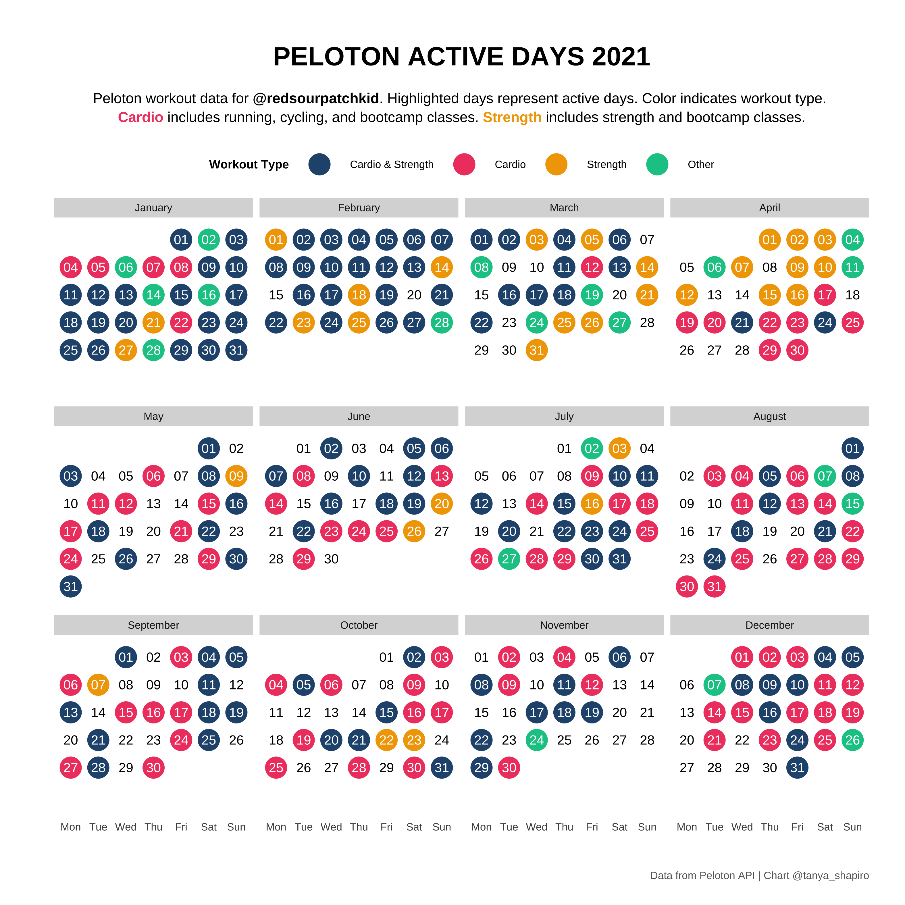

# Peloton Summary

This project provides an overview on how to collect personal Peloton data to create and summarize one's own workout information.

## Peloton Background

Peloton is a fitness company that produces exercise equipment, including stationary bicycles and treadmills, as well as a subscription-based fitness app. The company's products are designed to be used in the home and are accompanied by live and on-demand fitness classes that users can stream on their devices. Peloton's stationary bikes and treadmills are known for their sleek design and advanced technology, which includes touchscreens and other features that allow users to track their workouts and monitor their progress. The company's fitness app offers a wide range of classes, including cycling, running, strength training, yoga, and more.

Excerpt from [Wikipedia](https://en.wikipedia.org/wiki/Peloton_(exercise_equipment_company)):

> While Peloton's flagship offerings are cycling and running classes using their exercise machines, they also offer classes in strength training, yoga, cardio aerobic exercise, meditation, stretching, tread bootcamp, bike bootcamp, and walking.[ Classes are recorded daily and streamed live from instructors' homes or Peloton's cycling studios in Hudson Yards, Manhattan and London and are then uploaded to the Peloton library for on-demand access 24/7. Peloton produces up to 19 new classes a day.

## Data Collection

Data was collected using the Peloton API with an R wrapper, **pelotonR**. The R library pelotonR was created by Laura Ellis, GitHub documentation can be found [here](https://github.com/lgellis/pelotonR/tree/master/R). To use the API, one must provide their **username** and **password** for authentication - no token is required at this time. Data calls are specific to user's personal information.

Images for each instructor were downloaded using the image links collected from the API. Images for all instructors are also hosted [here](./images/instructors).

## Visualizations

### [Instructor Leaderboard - Reactable](https://github.com/tashapiro/peloton-stats/blob/main/code/peloton-nested-reacttable.R)
My personal instructor leaderboard so far this year (2022). Table created using **reactable** and **[reactablefmtr](https://github.com/kcuilla/reactablefmtr)**. Clicking on the detail expansion reveals aggregate info per fitness discipline. The detail expansion section was created with a nested reactable, I learned how to embed tables from [Vishal Katti's tutorial](https://www.vishalkatti.com/posts/2021-07-27-drilldown/).

### Instructor Summary - GT Table
Personal Workout Summary for 2021 by Instructor. Tables created using **[gtExtra](https://jthomasmock.github.io/gtExtras/)**.

### [Active Days Calendar](./code/peloton-active-days-calendar.R)
Graphic produced in the style of Peloton's Active Days Calendar. Depicts personal workouts for 2021 calendary year. Colors denote class types taken. Visual created using **ggplot**.

### [Change in Workout Habits](./code/peloton-ggbump.R)

Peloton offers a variety of workout classes - yoga, strength, cycling, running, etc. I wanted to see if and how my workout habits have changed over the past year and a half. For this analysis, I used ggbump to visualize how I've prioritized my time across different workout types. I ranked each workout type based on cumulative hours spent. Not surprised to see a major shift in cycling as soon as I bought the Peloton Bike!

### [Cumulative Time - Bar Race](./code/peloton-bar-race.R)
Depicts cumulative workout time per Peloton instructor from September 2020 through April 2022. Visual exported as GIF, rendered using **ggplot** and **ggannimate**.

